# High-Performance Order Book Engine

A low-latency limit order book implementation in C++20 with real-time market data integration. Built to handle high-frequency trading workloads with microsecond-level latency.

## Overview

This project implements a matching engine and order book that supports multiple order types, priority-based matching, and real-time market data processing. The architecture is designed for performance-critical applications where latency matters.

**Key metrics:**
- Order insertion: ~400,000 orders/sec
- Order matching: ~350,000 matches/sec
- Order cancellation: ~2,000,000 cancels/sec
- Average operation latency: 2-4 μs

## Features

### Core Order Book
- **Order Types**: GoodTillCancel, Market, FillAndKill, FillOrKill, GoodForDay
- **Matching Algorithm**: Price-time priority (FIFO within price levels)
- **Data Structures**: O(1) order lookup, O(log n) price level access
- **Trade Execution**: Automatic matching with partial fill support

### Market Data Feed
- Real-time orderbook snapshots via Binance REST API
- Incremental update processing (new orders, cancellations, modifications)
- Batch message processing for improved throughput
- Sequence number tracking for gap detection
- Latency monitoring and statistics

### Live Market Display
- Real-time visualization of cryptocurrency orderbooks
- Configurable refresh rates and depth levels
- Bid-ask spread analysis and mid-price calculation
- Market microstructure metrics


## Build Instructions

### Requirements
- CMake 3.10+
- C++20 compatible compiler (GCC 10+, Clang 10+, MSVC 2019+)
- Dependencies (automatically fetched via CMake):
  - libcurl 8.4.0
  - nlohmann/json 3.11.3

### Build

```bash
mkdir build && cd build
cmake ..
cmake --build . --config Release
```

### Run

```bash
# Run functionality and performance tests
./OrderBookTests

# Live cryptocurrency orderbook
./LiveMarketData SOLUSDT 1 20
# Args: [SYMBOL] [REFRESH_SECONDS] [DEPTH_LEVELS]
```

## Architecture

### Class Diagram

```mermaid
classDiagram
    %% Core Type Aliases
    class Types {
        <<typedef>>
        +Price: int32_t
        +Quantity: uint32_t
        +OrderId: uint64_t
    }

    %% Enumerations
    class OrderType {
        <<enumeration>>
        GoodTillCancel
        FillAndKill
        Market
        GoodForDay
        FillOrKill
    }

    class Side {
        <<enumeration>>
        Buy
        Sell
    }

    class MessageType {
        <<enumeration>>
        NewOrder
        CancelOrder
        ModifyOrder
        Trade
        BookSnapshot
    }

    %% Constants
    class Constants {
        <<static>>
        +InvalidPrice: Price
    }

    %% Order Classes
    class Order {
        -orderType_: OrderType
        -orderId_: OrderId
        -side_: Side
        -price_: Price
        -initialQuantity_: Quantity
        -remainingQuantity_: Quantity
        +Order(OrderType, OrderId, Side, Price, Quantity)
        +Order(OrderId, Side, Quantity)
        +GetOrderId(): OrderId
        +GetSide(): Side
        +GetPrice(): Price
        +GetOrderType(): OrderType
        +GetInitialQuantity(): Quantity
        +GetRemainingQuantity(): Quantity
        +GetFilledQuantity(): Quantity
        +IsFilled(): bool
        +Fill(Quantity): void
        +ToGoodTillCancel(Price): void
    }

    class OrderModify {
        -orderId_: OrderId
        -price_: Price
        -side_: Side
        -quantity_: Quantity
        +OrderModify(OrderId, Side, Price, Quantity)
        +GetOrderId(): OrderId
        +GetPrice(): Price
        +GetSide(): Side
        +GetQuantity(): Quantity
        +ToOrderPointer(OrderType): OrderPointer
    }

    %% Trade Classes
    class TradeInfo {
        +orderId_: OrderId
        +price_: Price
        +quantity_: Quantity
    }

    class Trade {
        -bidTrade_: TradeInfo
        -askTrade_: TradeInfo
        +Trade(TradeInfo, TradeInfo)
        +GetBidTrade(): TradeInfo
        +GetAskTrade(): TradeInfo
    }

    %% Level Info Classes
    class LevelInfo {
        +price_: Price
        +quantity_: Quantity
    }

    class OrderbookLevelInfos {
        -bids_: LevelInfos
        -asks_: LevelInfos
        +OrderbookLevelInfos(LevelInfos, LevelInfos)
        +GetBids(): LevelInfos
        +GetAsks(): LevelInfos
    }

    %% Market Data Messages
    class NewOrderMessage {
        +type: MessageType
        +orderId: OrderId
        +side: Side
        +price: Price
        +quantity: Quantity
        +orderType: OrderType
        +timestamp: time_point
    }

    class CancelOrderMessage {
        +type: MessageType
        +orderId: OrderId
        +timestamp: time_point
    }

    class ModifyOrderMessage {
        +type: MessageType
        +orderId: OrderId
        +side: Side
        +newPrice: Price
        +newQuantity: Quantity
        +timestamp: time_point
    }

    class TradeMessage {
        +type: MessageType
        +buyOrderId: OrderId
        +sellOrderId: OrderId
        +price: Price
        +quantity: Quantity
        +timestamp: time_point
    }

    class SnapshotLevel {
        +price: Price
        +quantity: Quantity
        +orderCount: int
    }

    class BookSnapshotMessage {
        +type: MessageType
        +bids: vector~SnapshotLevel~
        +asks: vector~SnapshotLevel~
        +timestamp: time_point
        +sequenceNumber: uint64_t
    }

    class MarketDataStats {
        +messagesProcessed: uint64_t
        +newOrders: uint64_t
        +cancellations: uint64_t
        +modifications: uint64_t
        +trades: uint64_t
        +snapshots: uint64_t
        +errors: uint64_t
        +sequenceGaps: uint64_t
        +totalProcessingTime: microseconds
        +maxLatency: microseconds
        +minLatency: microseconds
        +Reset(): void
        +GetAverageLatencyMicros(): double
    }

    %% Main Orderbook Class
    class Orderbook {
        -OrderEntry: struct
        -bids_: map~Price, OrderPointers~
        -asks_: map~Price, OrderPointers~
        -orders_: unordered_map~OrderId, OrderEntry~
        -lastDayReset_: time_point
        -dayResetHour_: hours
        -dayResetMinute_: int
        -stats_: MarketDataStats
        -lastSequenceNumber_: uint64_t
        -isInitialized_: bool
        -CanMatch(Side, Price): bool
        -CheckAndResetDay(): void
        -CancelGoodForDayOrders(): void
        -CollectMatchesForFillOrKill(): vector
        -ExecuteMatchesForFillOrKill(): Trades
        -MatchFillOrKill(OrderPointer): Trades
        -MatchOrders(): Trades
        -ProcessNewOrder(NewOrderMessage): void
        -ProcessCancel(CancelOrderMessage): void
        -ProcessModify(ModifyOrderMessage): void
        -ProcessTrade(TradeMessage): void
        -ProcessSnapshot(BookSnapshotMessage): void
        +Orderbook()
        +SetDayResetTime(int, int): void
        +AddOrder(OrderPointer): Trades
        +CancelOrder(OrderId): void
        +MatchOrder(OrderModify): Trades
        +Size(): size_t
        +GetOrderInfos(): OrderbookLevelInfos
        +ProcessMarketData(MarketDataMessage): bool
        +ProcessMarketDataBatch(vector): size_t
        +GetMarketDataStats(): MarketDataStats
        +ResetMarketDataStats(): void
        +IsInitialized(): bool
        +GetLastSequenceNumber(): uint64_t
    }

    class OrderEntry {
        <<internal struct>>
        +order_: OrderPointer
        +location_: iterator
    }

    %% Relationships
    Order --> OrderType: uses
    Order --> Side: uses
    OrderModify --> Side: uses
    OrderModify --> Order: creates
    
    Trade *-- TradeInfo: contains 2
    
    OrderbookLevelInfos *-- LevelInfo: contains many
    
    Orderbook *-- OrderEntry: contains
    Orderbook o-- Order: manages
    Orderbook --> Trade: produces
    Orderbook --> OrderbookLevelInfos: produces
    Orderbook *-- MarketDataStats: tracks
    
    NewOrderMessage --> MessageType: uses
    NewOrderMessage --> Side: uses
    NewOrderMessage --> OrderType: uses
    CancelOrderMessage --> MessageType: uses
    ModifyOrderMessage --> MessageType: uses
    ModifyOrderMessage --> Side: uses
    TradeMessage --> MessageType: uses
    BookSnapshotMessage --> MessageType: uses
    BookSnapshotMessage *-- SnapshotLevel: contains many
    
    Orderbook --> NewOrderMessage: processes
    Orderbook --> CancelOrderMessage: processes
    Orderbook --> ModifyOrderMessage: processes
    Orderbook --> TradeMessage: processes
    Orderbook --> BookSnapshotMessage: processes
    
    Constants --> Types: uses
```



### Order Book Structure

```
Orderbook
├── bids_: map<Price, OrderPointers, greater>  // Best bid first
├── asks_: map<Price, OrderPointers, less>     // Best ask first
└── orders_: unordered_map<OrderId, OrderEntry> // O(1) lookup
```

**Price levels** are stored in ordered maps for efficient best bid/ask access. Within each price level, orders are maintained in a FIFO queue for time priority.

**Order lookup** uses a hash map storing both the order pointer and its iterator position, enabling O(1) cancellation.

### Matching Logic

Orders match when:
- Buy price ≥ Best ask price, or
- Sell price ≤ Best bid price

Matching proceeds in price-time priority:
1. Best price levels matched first
2. Within a price level, earliest orders matched first (FIFO)
3. Partial fills supported for all order types except FillOrKill

### Market Data Processing

The orderbook can be initialized and updated via market data messages:
- **BookSnapshotMessage**: Full orderbook rebuild
- **NewOrderMessage**: Add order to book
- **CancelOrderMessage**: Remove order from book
- **ModifyOrderMessage**: Modify existing order (cancel + add)
- **TradeMessage**: Record executed trade (informational)

Processing pipeline tracks sequence numbers, latency, and message statistics.

## Performance Characteristics

| Operation | Complexity | Measured Throughput |
|-----------|-----------|---------------------|
| Add Order | O(log n) | ~400K ops/sec |
| Cancel Order | O(1) | ~2M ops/sec |
| Modify Order | O(log n) | ~270K ops/sec |
| Match Orders | O(k log n) | ~350K matches/sec |
| Get Order Info | O(m) | ~500K snapshots/sec |

*n = number of price levels, k = number of matches, m = number of orders*

Benchmarks run on typical development hardware. Actual performance depends on system configuration and workload characteristics.

## Implementation Notes

### Design Decisions

**Why separate bids/asks maps?** Allows different sorting orders (descending for bids, ascending for asks) and simplifies best bid/ask access.

**Why store iterators in OrderEntry?** Enables O(1) removal from the price level list when canceling orders.

**Why shared_ptr for orders?** Allows orders to be referenced in multiple places (main map, price level list) without copying. Trade-off between memory overhead and simplicity.

**Market order conversion:** Market orders are converted to limit orders at extreme prices (max/min) to reuse the matching logic.

### Order Type Behavior

- **GoodTillCancel**: Remains active until filled or cancelled
- **Market**: Immediately converted to aggressive limit order
- **FillAndKill**: Partial fills accepted, unfilled portion cancelled
- **FillOrKill**: All-or-nothing execution, rejected if can't fill completely
- **GoodForDay**: Cancelled at configured time (default 15:59)

### Live Market Data

The live display fetches orderbook snapshots from Binance's REST API at configurable intervals. Each snapshot replaces the previous orderbook state. This approach is suitable for visualization but not for production trading systems, which would use WebSocket feeds for incremental updates.

## Testing

**Functionality tests** verify correctness of matching logic, order types, and edge cases.

**Performance benchmarks** measure throughput and latency under various workloads.

**Market data tests** simulate realistic trading scenarios with thousands of orders.

Run all tests:

```bash
./OrderBookTests
```

## Use Cases

- Algorithmic trading strategy backtesting
- Market microstructure research
- Order routing simulation
- Exchange matching engine prototyping
- Educational tool for understanding limit order books

## Limitations

- Single instrument (no multi-asset support)
- No persistence layer
- Live data uses polling instead of WebSocket streaming
- Synthetic order IDs for aggregated book levels
- No regulatory compliance features (audit logs, trade reporting)

## Future Enhancements

Potential extensions for production use:
- WebSocket feed integration for lower latency
- Position and risk management
- Multiple matching algorithms (pro-rata, size pro-rata)
- Iceberg and other advanced order types
- Historical data replay and backtesting framework
- Market impact modeling
